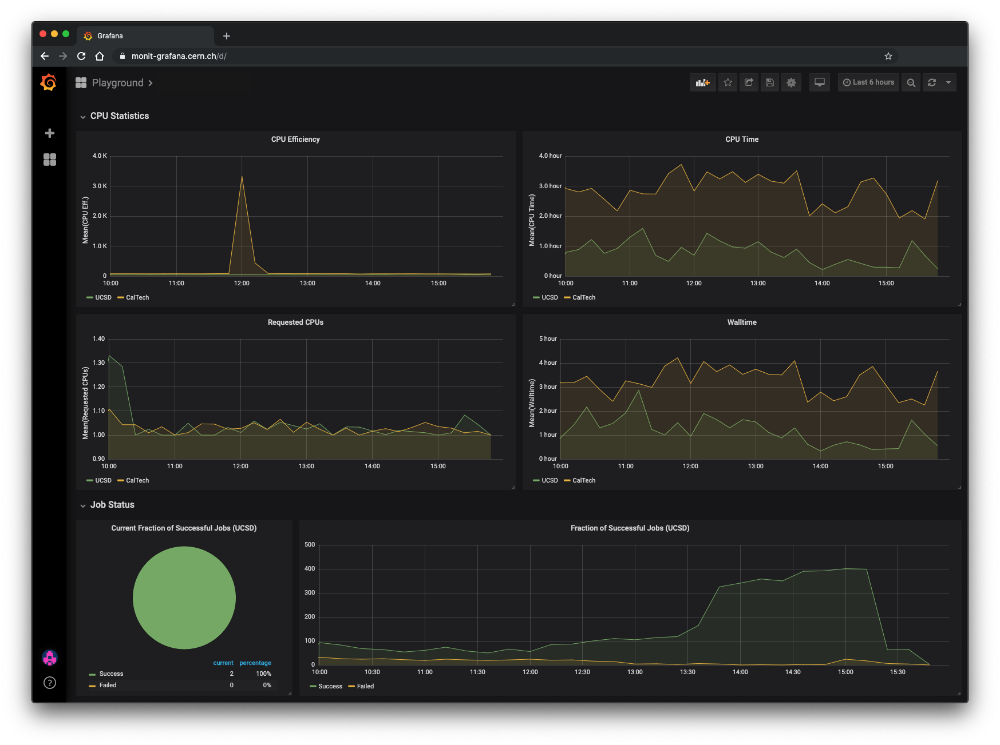

# What is TUDA?

TUDA was developed with funding from Google Summer of Code through the CMS Data Access 
[project](https://summerofcode.withgoogle.com/archive/2019/projects/5441440799260672/) for [CERN-HSF](http://hepsoftwarefoundation.org/). More specifically, TUDA's namesake "tools" allow for the aggregation and analysis of data pertaining to the usage of the US CMS cache infrastructure. TUDA has been uploaded to [Zenodo](https://doi.org/10.5281/zenodo.3636224), so citation instructions, along with a list of current citations, can be found there.

### The Cache Infrastructure
Data is constantly being produced at the Large Hadron Collider (LHC), both in the form of simulations and actual recordings from the detector. Put simply, the LHC produces a _lot_ of data. As such, it quickly became apparent that the distribution of that data must be considered carefully. To this end, a cache infrastructure was created where files may be requested, then cached at various, more convenient locations such that they may be retrieved faster and more efficiently in the future.

### The Problem
The cache infrastructure poses, of course, an optimization problem itself. In order to address this problem, the caches must first be monitored in order to produce a solution that fits the actual needs of the users. However, current monitoring tools show cache activity in real time, which is not particularly useful for understanding overall cache behavior. Furthermore, a particularly inspired individual may collect this instantaneous data in order to piece together a more macroscopic view of the cache activity, but this is incredibly time consuming and begs for automation - that is, until Monicron came into the picture.

# Monicron
Foremost among these tools is the [Monicron](https://github.com/jkguiang/tuda/tree/master/monit) application, which aggregates data in regular, predefined intervals, then pushes these aggregations (defined [here](https://github.com/jkguiang/tuda/tree/master/monit/notebooks)) to a database such that graphical dashboards may be used to visualize the aggregated data, allowing for a single user to monitor the health of the US CMS cache infrastructure "at a glance." The documentation for Monicron can be found [here](https://github.com/jkguiang/tuda/wiki).

### Workflow
First, Pyspark is used to query the Hadoop File System (HDFS) hosted by CERN for data of various categories. Once the data has been collected, it is converted into a Pandas dataframe for final aggregation. A [plugin](https://github.com/jkguiang/tuda/tree/master/monit#adding-a-hdfs-source) system was devised to allow the application to be extentable to other parts of the US CMS cache infrastructure, an extension that is planned to take place in the near future. These aggregations are cached locally, then pushed through StompAMQ to an Elasticsearch database maintained by the MONIT Team at CERN in order to take advantage of the Grafana service set up by them. The entire application is deployed within a Docker container on a VM hosted by CERN Openstack.

### Insights
Although only recently implemented, Monicron has already provided new and useful information, and those listed here are only a handful of what Monicron delivers.
- **[Preliminary Results](http://uaf-10.t2.ucsd.edu/~jguiang/presentations/monicron/monicron_08-15-2019.pdf):** Though only in its early stages, these plots produced from Monicron data provided some immediate insights. Here, only a few a summarized. First, slide 4 shows that the number of unique files stored in the cache varies greatly over time. Second, from the plots on slide 6, it became evident that the users are only reading approximately 10% of each file stored in the cache on average. Third, on slides 4, 6, 13, and 16, there is a clear spike in cache activity in each plot. All of these observations revealed previously unknown cache behaviors.
- **[Refined Study](http://uaf-10.t2.ucsd.edu/~jguiang/presentations/monicron/monicron_08-20-2019.pdf):** Shortly after reviewing the previous results, a more refined study was performed, the latter half (slides 5 to 7) of which explored the spike in cache activity observed in the previous plots. The plots on these slides simply have points in the activity spike labeled with dates and relevant metrics. For example, on slide 6, it is evident that the maximum point in the activity spike did not necessarily correlated with good or bad CPU efficiency.

As mentioned in the previous section, the aggregated data produced by Monicron can be interactively visualized on Grafana dashboards. These are only accessible to certain members of the CMS collaboration, however an example dashboard is displayed below:

# Other Tools
Various analyses were performed in order to validate steps towards Monicron or otherwise satisfy general curiousity. There are two contained in this repository:
1. **[ClassAds vs. XRootD Analysis](https://nbviewer.jupyter.org/github/jkguiang/tuda/blob/master/analysis/SanityChecks_XRootD-vs-ClassAds.ipynb):** Early on, an analysis of the agreement between two separate monitoring sources, ClassAds and XRootD covering clientside and serverside cache access information respectively, was performed in order to determine if the two could be reliably coupled in order to form a complete description of cache access patterns. It was found that the two _generally_ agreed, however they did not _completely_ agree for reasons that remain a mystery at the time of writing.

2. **[ClassAds Classifier](https://nbviewer.jupyter.org/github/jkguiang/tuda/blob/master/analysis/BDT.ipynb):** In direct response to the analysis described above, a Boosted Decision Tree (BDT) was trained with the intent of creating a classifier that would determine which ClassAds are likely to not be accounted for in XRootD and vice versa. The BDT did not yield any particularly interesting results, but it established a framework for future efforts.

# Presentations
Due to the collaborative nature of any work done at CERN, Monicron has already been the subject of some discussion. Presentations given on Monicron and related TUDA projects are listed here:
1. [Jul. 31st, 2019](http://uaf-10.t2.ucsd.edu/~jguiang/presentations/monicron/monicron_07-31-2019.pdf): Outline of proposed aggregations (given at the OSG weekly meeting)
2. [Aug. 7th, 2019](http://uaf-10.t2.ucsd.edu/~jguiang/presentations/monicron/monicron_08-07-2019.pdf): Outline of proposed data structures to be sent to MONIT's database (shared at the CMS Computer Monitoring biweekly meeting)
